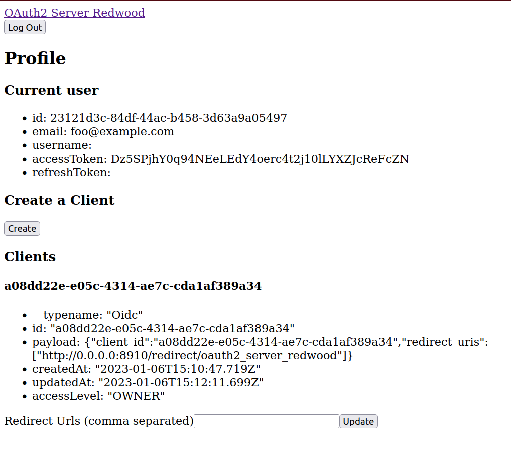

<h1 align="left">Welcome to Oauth2 Server Redwood 👋</h1>

  

> OAuth2 server with dynamic client registration and test API, built with Oidc-Provider for RedwoodJS

🚧 IN DEVELOPMENT 🚧

"Authority" means that you are providing authentication or authorization as a service for _other apps_. For example "Sign in with MyCompanyApp", as opposed to "Sign in with Google".  If you're just looking to implement an OAuth2 client in your app, check out [`oauth2-client-redwood`][oauth2-client-redwood].

## Demo ⏯️

Hosted demo coming soon

## Usage

To run this example app locally, clone this repo, copy the `.env.example` to `.env`, and run `yarn rw dev`.

To add the OAuth2 server to your own app, see the Readme: [packages/oauth2-server/README.md](https://github.com/UseKeyp/oauth2-server-redwood/blob/dev/packages/oauth2-server/README.md)

## Sponsors ❤️

[][sponsor-keyp] Improve onboarding and payments in your games & web3 apps effortlessly with OAuth logins for wallets and debit card transactions. [Create a Keyp account; it's free!][sponsor-keyp]  

## License 📝

Copyright © 2023 Nifty Chess, Inc. 
This project is MIT licensed.

[sponsor-keyp]: https://UseKeyp.com
[oauth2-client-redwood]: https://github.com/UseKeyp/oauth2-client-redwood

