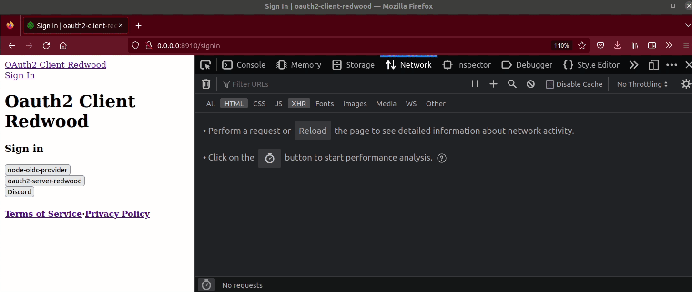
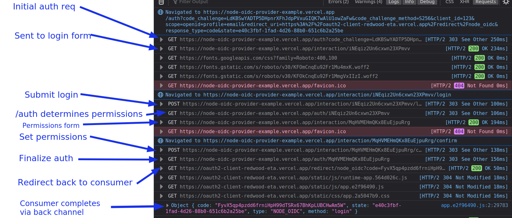

<h1 align="left">Welcome to Oauth2 Client Redwood 👋</h1>

  

> An OAuth2 provider built using Redwood and oidc-provider

🚧 IN DEVELOPMENT 🚧

"Authority" means that you are providing authentication or authorization as a service for _other apps_. For example "Sign in with MyCompanyApp", as opposed to "Sign in with Google".  If you're just looking to implement an OAuth2 client in your app, check out [`oauth2-client-redwood`](https://github.com/usekeyp/oauth2-client-redwood).

## Demo ⏯️

Hosted demo coming soon

In the example gif above, its important to note that the server is wrapping the user's Discord account with its own account (double authentication). The flow could also just use normal username/password.
## Developing

Here's the user-agent flow for a standard node-oidc-provider. Note ours is slightly modified, since we use our Redwood app UI for the login and consent screens.

## Contributing 💡

To run this repo locally:

- Update your .env from `.env.example`.
- You'll need to setup a nginx proxy, since oidc-provider sometimes ignores the extra `/api` path prefix, and cookie paths are not set properly. I've included `oauth2-server-redwood.conf` which removes the prefix and serves the endpoint from `localhost/oauth` instead of `localhost/api/oauth`. I'm open to other ideas here if you'd like to help!
- Run `yarn build` in `/packages/oauth2-server

## TODO

- [x] Validate rw session tokens during login
- [ ] Add claims to the user model and fetch in `findAccount`
- [ ] Show proper scopes for consent page
- [ ] Improve the UI
- [ ] Fix redirect bug to /profile
- [ ] Add dbAuth username/password option to make the demo simpler to understand
- [ ] Security audit
## Resources 🧑‍💻

- OAuth Server libraries: https://oauth.net/code/nodejs/
- Similar tools https://github.com/panva/oauth4webapi/blob/main/examples/code.ts and https://github.com/panva/node-openid-client

## Sponsors ❤️

[][sponsor-keyp] Improve onboarding and payments in your games & web3 apps effortlessly with OAuth logins for wallets and debit card transactions. [Create a Keyp account; it's free!][sponsor-keyp]  

## License 📝

Copyright © 2023 Nifty Chess, Inc. 
This project is MIT licensed.

[sponsor-keyp]: https://UseKeyp.com

